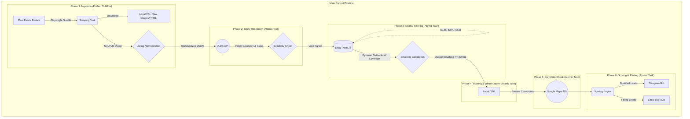

# Automated Real Estate Parcel Scoring Pipeline - Design Document

## 1. Problem Statement
Finding a suitable plot of land for building a residential house (~250 m²) in the Warsaw agglomeration is a highly manual, time-consuming process. It requires strict adherence to Polish building codes (Warunki techniczne), local zoning plans (MPZP), and environmental constraints. 

Manual filtering of real estate listings (e.g., on Otodom, OLX, Morizon) often fails because sellers hide critical flaws (e.g., flood risks, immediate proximity to high-voltage lines) or miscalculate legal building envelopes (e.g., failing to subtract the required 12-meter setback from a forest). 

This project automates the ingestion, spatial analysis, and scoring of real estate listings to deliver highly qualified, verified leads via Telegram.

## 2. Core Business Requirements (The "Golden Parcel" Criteria)
1. **Forest Proximity but Legal Compliance:** The parcel must be next to a forest, but the building envelope must respect a strict **12-meter setback** from any adjacent land classified as forest (`Ls`). The parcel itself must not be classified as `Ls`. The parcel must be suitable for building a house (e.g., not a swamp, not a protected area).
2. **Usable Building Envelope:** After subtracting legal setbacks (calculated using the official EGiB database), the remaining usable area must be at least **200 m²** with a geometry allowing southern/south-western exposure for the main living areas.
3. **Quiet & Clean Environment:** Exclude immediate proximity to major highways, high-voltage power lines, railway lines, industrial zones, aeroways, and high noise map zones (>50 dB).
4. **Hydro-geological Safety:** Strict exclusion of parcels intersecting with flood risk zones (ISOK). Penalize proximity to major drainage ditches (rowy melioracyjne).
5. **Commute:** Acceptable driving time with traffic to Warsaw Varso Tower (Chmielna 69) during peak hours (ideally < 45 minutes) and public transport transit time (ideally < 60 minutes).
6. **Infrastructure:** Reasonable proximity to schools, kindergartens, supermarkets, essential utility networks (water, electricity, sewage), and paved access roads.

## 3. System Architecture & Data Strategy

The system uses a **Hybrid Data Retrieval Strategy** to balance accuracy, API rate limits, and processing speed:
* **Live APIs:** Used for dynamic data. Parcel geometry and current legal status (e.g., `Ls` classification) are fetched in real-time from the state ULDK API based on the parcel ID extracted from the listing.
* **Local PostGIS (Offline):** A manually prepared, one-time loaded database used for static spatial data to enable lightning-fast spatial operations (`ST_Distance`, `ST_Intersects`, `ST_Buffer`).

### 3.1 Data Dictionary
| Dataset | Source | Purpose |
| :--- | :--- | :--- |
| **Listing Data** | Scrapers (Otodom, etc.) | Price, URL, Raw Images, Text |
| **Parcel Geometry** | ULDK API (Live) | Exact polygon, area, `Ls` check |
| **Forest/Land Use Boundaries** | EGiB (Local Dump) | Exact setbacks calculation |
| **Flood Zones** | ISOK (Local Dump) | Hydro-geological safety |
| **Infrastructure/Utilities** | GESUT, OSM, BDOT10k (Local) | Proximity to grids, roads |
| **Routing (Offline)** | OTP (OpenTripPlanner) | True walking/driving distance to infrastructure |
| **Commute (Live)** | Google Maps API | Peak-hour driving and transit times |
| **Noise Maps** | Mapy akustyczne (Local Dump) | Acoustic environment filtering |
| **Transaction Prices** | RCN (Local Dump) | Price validation |

### 3.2 High-Level Architecture Diagram

## 4. Technology Stack
The pipeline is designed as a non-productionized script executed ad-hoc on a single Ubuntu personal computer. 

* **Infrastructure & Deployment:**
  * Docker Compose (orchestrates PostgreSQL/PostGIS, OTP)
  * Local File System (used for debugging to store raw scraped images and HTML)
* **Orchestration:** Prefect 2.x (adhoc execution during development, schedule configurable later)
* **Database:** PostgreSQL with PostGIS extension (manually prepared one-time DB)
* **ORM & Database Access:** SQLAlchemy 2.0 (asyncpg), GeoAlchemy2
* **Data Processing:** GeoPandas, Shapely
* **Scraping Engine:**
  * Playwright Stealth (connecting to a local Chrome instance in debug mode to bypass anti-bot protections)
  * qwen2.5-vl:7b via Ollama (Local VLM for extracting parcel numbers from listing images)
  * Ollama (Local LLM for unstructured text parsing)
* **Routing:** Local OpenTripPlanner (OTP) instance (offline base routing) and Google Maps Directions API
* **Notifications:** Telegram Bot API

## 5. Detailed Pipeline Blueprint

### Phase 1: Multi-Source Ingestion & Normalization
- **Scraper Flow:** Connect to a local Chrome instance in debug mode using Playwright to navigate listings (e.g., Otodom) and bypass anti-bot protections. Extracts listing metadata, descriptions, and high-quality image URLs. This step is orchestrated as a dedicated Prefect flow.
- **Storage:** Persists the raw scraped data directly into a local PostgreSQL database (`raw_listings` table).
- **Text Parsing Flow:** Uses a local LLM (Ollama, model `qwen2.5:14b-instruct`) to extract the exact parcel number and utility presence from unstructured text. Enforces strict schema validation using Pydantic.
- **Normalization:** Saves the validated, extracted data into the `parsed_listings` table to decouple the unstructured source text from the rest of the spatial pipeline.

### Phase 2: Entity Resolution & Verification
- Use the extracted parcel number and `gmina` to query the **ULDK API**.
- Retrieve the official WKT polygon for the parcel.
- **Immediate Disqualification:** Check if the parcel itself is suitable for residential construction (e.g., classified as `B`, `Bp`, `R`, `Br`, etc. where permitted). Reject if the land is inherently unbuildable or legally protected (e.g., classified exclusively as forest `Ls`, wetlands, or other restricted types).

### Phase 3: Spatial Filtering & Setbacks
- Query the local **PostGIS database** (EGiB tables) for neighboring geometries.
- Subtract legal setbacks from the parcel polygon to determine the true building envelope. The setback values (e.g., 12m from neighboring `Ls` land, standard 3m/4m boundaries) and the maximum allowed building coverage percentage must be fetched dynamically (e.g., via spatial intersection with MPZP zoning plans or standard parameters) and factored into the area calculation.
- Calculate the usable area (must be >= 200 m²).
- Evaluate solar orientation based on the envelope's geometry.
- Check intersections against ISOK (flood zones), noise maps, and infrastructure exclusion zones (power lines, ditches).

### Phase 4: Routing & Infrastructure Profiling
- Use **Local OpenTripPlanner (OTP)** to verify true walking/driving distances (not straight-line) to nearby schools, kindergartens, and supermarkets found in the PostGIS BDOT10k/OSM dumps. 

### Phase 5: Commute Verification (Cost-sensitive API)
- Execute this step **only** if the parcel has passed all previous spatial, infrastructure, and hard constraint checks to avoid unnecessary API costs.
- Query the **Google Maps Directions API** to calculate commute times to Varso Tower (Chmielna 69) during peak hours.

### Phase 6: Scoring Engine & Alerting
- Apply the scoring algorithm based on the aggregated metrics.
- Send all results (during the testing phase) to **Telegram**, detailing exactly why the plot scored well or failed, presented in a human-readable format.